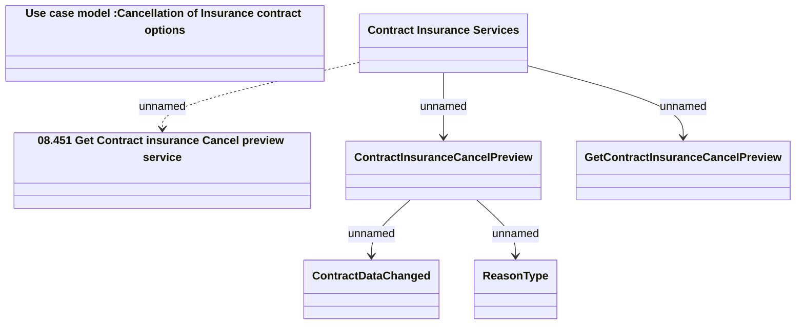

# Contract Insurance Change Requests - GET: ContractInsuranceCancelPreview

- **Diagram Type**: Logical
- **Package**: HomerSelect/BSL/Analysis Model/Contract Management/Customer Self-Care API/Application Interface Model/CSI OpenAPI/Contract Insurance Services/v1.0
- **Diagram ID**: 161873
- **Elements**: 7
- **Connectors**: 5

