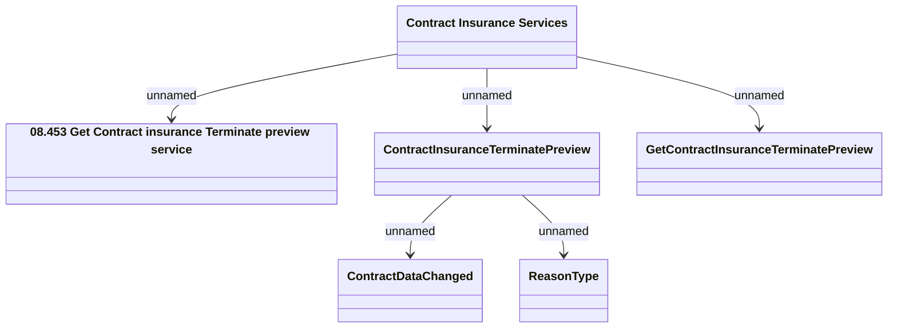

# Contract Insurance Change Requests - GET: ContractInsuranceTerminatePreview

```mermaid
classDiagram
    class n_08_453_Get_Contract_insurance_Terminate_preview_service["08.453 Get Contract insurance Terminate preview service"]
    class ContractInsuranceTerminatePreview["ContractInsuranceTerminatePreview"]
    class GetContractInsuranceTerminatePreview["GetContractInsuranceTerminatePreview"]
    class ReasonType["ReasonType"]
    class ContractDataChanged["ContractDataChanged"]
    class Contract_Insurance_Services["Contract Insurance Services"]
    ContractInsuranceTerminatePreview --> ContractDataChanged : unnamed
    ContractInsuranceTerminatePreview --> ReasonType : unnamed
    Contract_Insurance_Services --> GetContractInsuranceTerminatePreview : unnamed
    Contract_Insurance_Services --> ContractInsuranceTerminatePreview : unnamed
    Contract_Insurance_Services --> n_08_453_Get_Contract_insurance_Terminate_preview_service : unnamed
```
