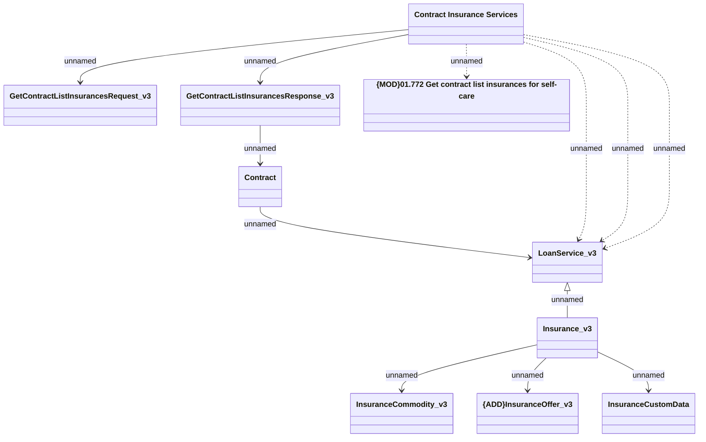

# Contract Insurance Service: GET Contract Insurance Service

- **Diagram Type**: Logical
- **Package**: HomerSelect/BSL/Analysis Model/Contract Management/Customer Self-Care API/Application Interface Model/CSI OpenAPI/Contract Insurance Services/v3_proposal
- **Diagram ID**: 161867
- **Elements**: 10
- **Connectors**: 12

