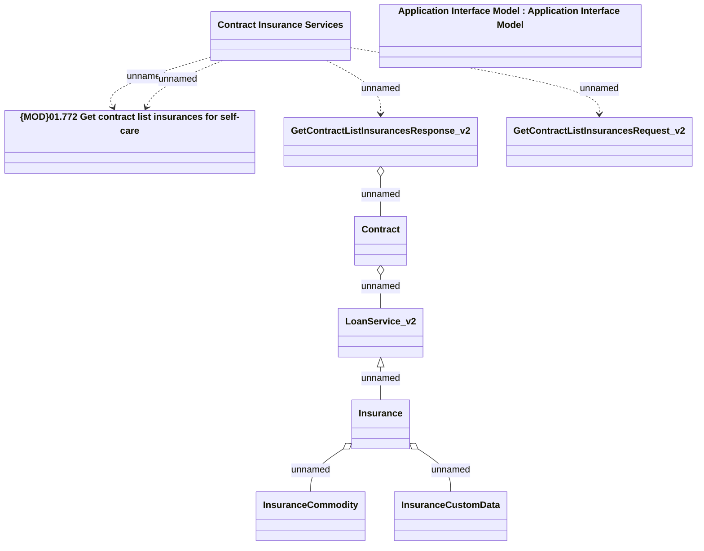

# Contract Insurance Services - GET: Contract list Insurances

- **Diagram Type**: Logical
- **Package**: HomerSelect/BSL/Analysis Model/Contract Management/Customer Self-Care API/Application Interface Model/CSI OpenAPI/Contract Insurance Services/v2.0
- **Diagram ID**: 147955
- **Elements**: 10
- **Connectors**: 9

