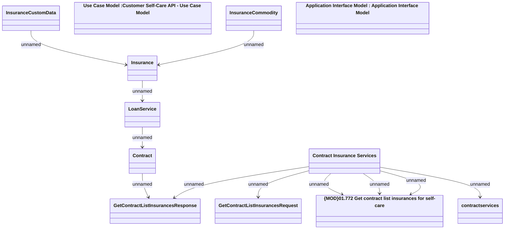

# Contract Insurance Services - GET: Contract list Insurances

```mermaid
classDiagram
    class contractservices["contractservices"]
    class InsuranceCustomData["InsuranceCustomData"]
    class Contract_Insurance_Services["Contract Insurance Services"]
    class Use_Case_Model_Customer_Self_Care_API_Use_Case_Model["Use Case Model :Customer Self-Care API - Use Case Model"]
    class MOD_01_772_Get_contract_list_insurances_for_self_care["{MOD}01.772 Get contract list insurances for self-care"]
    class Contract["Contract"]
    class InsuranceCommodity["InsuranceCommodity"]
    class Insurance["Insurance"]
    class LoanService["LoanService"]
    class GetContractListInsurancesResponse["GetContractListInsurancesResponse"]
    class GetContractListInsurancesRequest["GetContractListInsurancesRequest"]
    class Application_Interface_Model_Application_Interface_Model["Application Interface Model : Application Interface Model"]
    Contract_Insurance_Services --> GetContractListInsurancesRequest : unnamed
    Contract --> GetContractListInsurancesResponse : unnamed
    Contract_Insurance_Services --> GetContractListInsurancesResponse : unnamed
    Insurance --> LoanService : unnamed
    InsuranceCustomData --> Insurance : unnamed
    InsuranceCommodity --> Insurance : unnamed
    LoanService --> Contract : unnamed
    Contract_Insurance_Services --> MOD_01_772_Get_contract_list_insurances_for_self_care : unnamed
    Contract_Insurance_Services --> MOD_01_772_Get_contract_list_insurances_for_self_care : unnamed
    Contract_Insurance_Services --> MOD_01_772_Get_contract_list_insurances_for_self_care : unnamed
    Contract_Insurance_Services --> contractservices : unnamed
```
