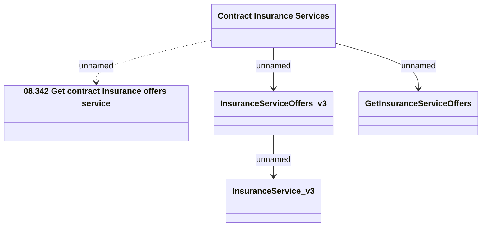

# Contract Insurance Services - GET: Insurance Service Offers v3

- **Diagram Type**: Logical
- **Package**: HomerSelect/BSL/Analysis Model/Contract Management/Customer Self-Care API/Application Interface Model/CSI OpenAPI/Contract Insurance Services/v3
- **Diagram ID**: 161866
- **Elements**: 5
- **Connectors**: 4

