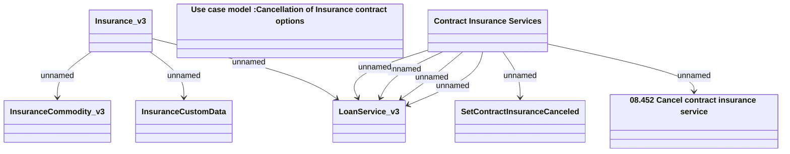

# Contract Insurance Services - POST: Contract Insurance Service Cancel v3

```mermaid
classDiagram
    class Insurance_v3["Insurance_v3"]
    class InsuranceCommodity_v3["InsuranceCommodity_v3"]
    class InsuranceCustomData["InsuranceCustomData"]
    class LoanService_v3["LoanService_v3"]
    class Use_case_model_Cancellation_of_Insurance_contract_options["Use case model :Cancellation of Insurance contract options"]
    class n_08_452_Cancel_contract_insurance_service["08.452 Cancel contract insurance service"]
    class SetContractInsuranceCanceled["SetContractInsuranceCanceled"]
    class Contract_Insurance_Services["Contract Insurance Services"]
    Contract_Insurance_Services --> LoanService_v3 : unnamed
    Contract_Insurance_Services --> LoanService_v3 : unnamed
    Contract_Insurance_Services --> SetContractInsuranceCanceled : unnamed
    Contract_Insurance_Services --> LoanService_v3 : unnamed
    Contract_Insurance_Services --> LoanService_v3 : unnamed
    Contract_Insurance_Services --> n_08_452_Cancel_contract_insurance_service : unnamed
    Insurance_v3 --> InsuranceCommodity_v3 : unnamed
    Insurance_v3 --> InsuranceCustomData : unnamed
    Insurance_v3 --> LoanService_v3 : unnamed
```
