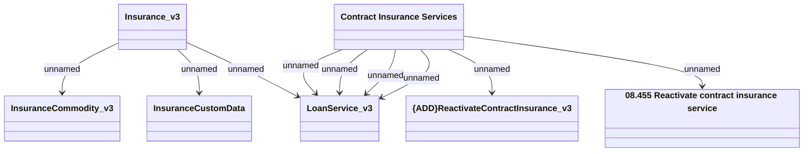

# Contract Insurance Services - POST: Contract Insurance Service Reactivate v3

```mermaid
classDiagram
    class Insurance_v3["Insurance_v3"]
    class InsuranceCommodity_v3["InsuranceCommodity_v3"]
    class InsuranceCustomData["InsuranceCustomData"]
    class LoanService_v3["LoanService_v3"]
    class ADD_ReactivateContractInsurance_v3["{ADD}ReactivateContractInsurance_v3"]
    class n_08_455_Reactivate_contract_insurance_service["08.455 Reactivate contract insurance service"]
    class Contract_Insurance_Services["Contract Insurance Services"]
    Contract_Insurance_Services --> LoanService_v3 : unnamed
    Contract_Insurance_Services --> LoanService_v3 : unnamed
    Contract_Insurance_Services --> ADD_ReactivateContractInsurance_v3 : unnamed
    Contract_Insurance_Services --> n_08_455_Reactivate_contract_insurance_service : unnamed
    Contract_Insurance_Services --> LoanService_v3 : unnamed
    Contract_Insurance_Services --> LoanService_v3 : unnamed
    Insurance_v3 --> InsuranceCommodity_v3 : unnamed
    Insurance_v3 --> InsuranceCustomData : unnamed
    Insurance_v3 --> LoanService_v3 : unnamed
```
