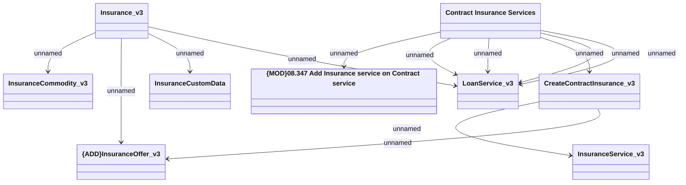

# Contract Insurance Services - POST: Contract Insurance Service v3

```mermaid
classDiagram
    class ADD_InsuranceOffer_v3["{ADD}InsuranceOffer_v3"]
    class Insurance_v3["Insurance_v3"]
    class InsuranceCommodity_v3["InsuranceCommodity_v3"]
    class InsuranceCustomData["InsuranceCustomData"]
    class MOD_08_347_Add_Insurance_service_on_Contract_service["{MOD}08.347 Add Insurance service on Contract service"]
    class LoanService_v3["LoanService_v3"]
    class Contract_Insurance_Services["Contract Insurance Services"]
    class InsuranceService_v3["InsuranceService_v3"]
    class CreateContractInsurance_v3["CreateContractInsurance_v3"]
    CreateContractInsurance_v3 --> InsuranceService_v3 : unnamed
    CreateContractInsurance_v3 --> ADD_InsuranceOffer_v3 : unnamed
    Contract_Insurance_Services --> MOD_08_347_Add_Insurance_service_on_Contract_service : unnamed
    Contract_Insurance_Services --> LoanService_v3 : unnamed
    Contract_Insurance_Services --> LoanService_v3 : unnamed
    Contract_Insurance_Services --> CreateContractInsurance_v3 : unnamed
    Contract_Insurance_Services --> LoanService_v3 : unnamed
    Contract_Insurance_Services --> LoanService_v3 : unnamed
    Insurance_v3 --> InsuranceCommodity_v3 : unnamed
    Insurance_v3 --> ADD_InsuranceOffer_v3 : unnamed
    Insurance_v3 --> InsuranceCustomData : unnamed
    Insurance_v3 --> LoanService_v3 : unnamed
```
