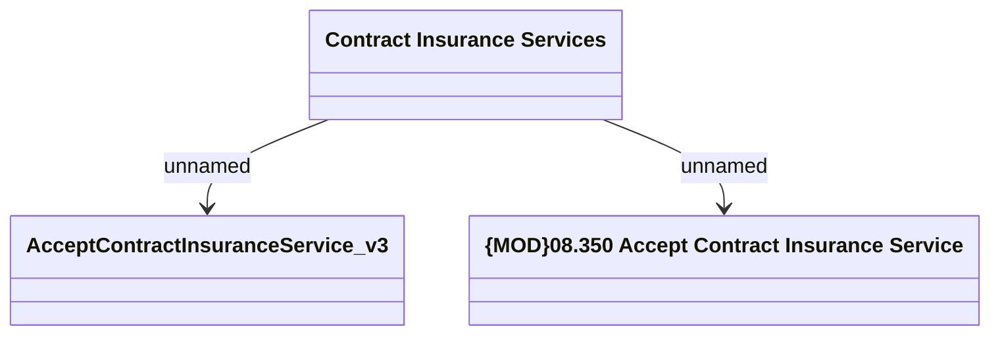

# Contract Insurance Services - PUT: Accept Contract Insurance Service v3

```mermaid
classDiagram
    class AcceptContractInsuranceService_v3["AcceptContractInsuranceService_v3"]
    class MOD_08_350_Accept_Contract_Insurance_Service["{MOD}08.350 Accept Contract Insurance Service"]
    class Contract_Insurance_Services["Contract Insurance Services"]
    Contract_Insurance_Services --> AcceptContractInsuranceService_v3 : unnamed
    Contract_Insurance_Services --> MOD_08_350_Accept_Contract_Insurance_Service : unnamed
```
