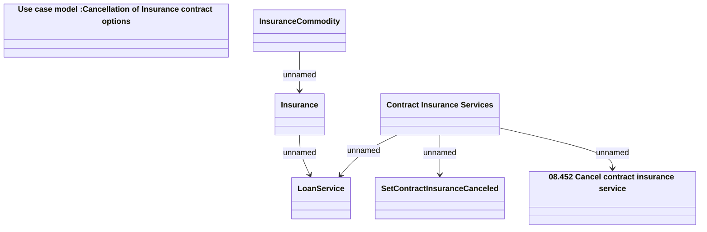

# Contract Insurance Services - PUT: Contract Insurance Service Cancel

```mermaid
classDiagram
    class Use_case_model_Cancellation_of_Insurance_contract_options["Use case model :Cancellation of Insurance contract options"]
    class n_08_452_Cancel_contract_insurance_service["08.452 Cancel contract insurance service"]
    class InsuranceCommodity["InsuranceCommodity"]
    class Insurance["Insurance"]
    class LoanService["LoanService"]
    class SetContractInsuranceCanceled["SetContractInsuranceCanceled"]
    class Contract_Insurance_Services["Contract Insurance Services"]
    Contract_Insurance_Services --> SetContractInsuranceCanceled : unnamed
    Contract_Insurance_Services --> LoanService : unnamed
    Insurance --> LoanService : unnamed
    InsuranceCommodity --> Insurance : unnamed
    Contract_Insurance_Services --> n_08_452_Cancel_contract_insurance_service : unnamed
```
