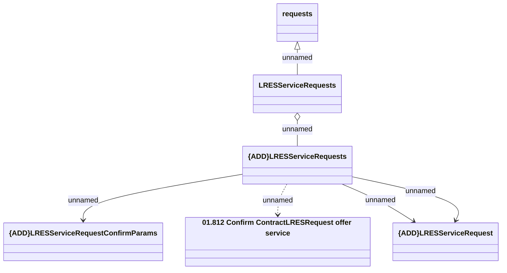

# Contract LRES Service Requests - confirm offer

- **Diagram Type**: Logical
- **Package**: HomerSelect/BSL/Analysis Model/Contract Management/Customer Self-Care API/Application Interface Model/CSI OpenAPI/Contract Service Requests/Contract LRES Service Requests
- **Diagram ID**: 131793
- **Elements**: 6
- **Connectors**: 6

