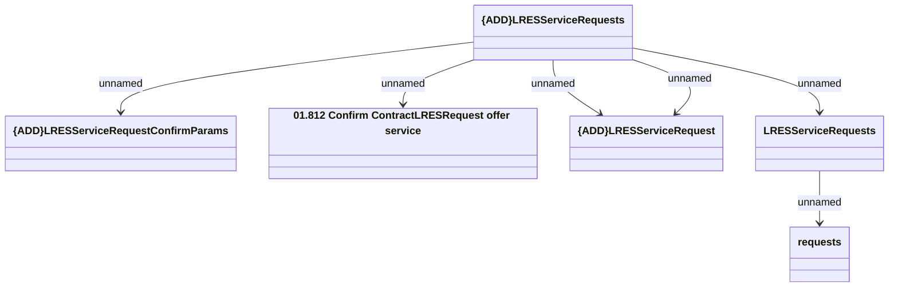

# Contract LRES Service Requests - confirm offer

```mermaid
classDiagram
    class ADD_LRESServiceRequestConfirmParams["{ADD}LRESServiceRequestConfirmParams"]
    class n_01_812_Confirm_ContractLRESRequest_offer_service["01.812 Confirm ContractLRESRequest offer service"]
    class ADD_LRESServiceRequest["{ADD}LRESServiceRequest"]
    class ADD_LRESServiceRequests["{ADD}LRESServiceRequests"]
    class LRESServiceRequests["LRESServiceRequests"]
    class requests["requests"]
    ADD_LRESServiceRequests --> ADD_LRESServiceRequestConfirmParams : unnamed
    ADD_LRESServiceRequests --> n_01_812_Confirm_ContractLRESRequest_offer_service : unnamed
    LRESServiceRequests --> requests : unnamed
    ADD_LRESServiceRequests --> LRESServiceRequests : unnamed
    ADD_LRESServiceRequests --> ADD_LRESServiceRequest : unnamed
    ADD_LRESServiceRequests --> ADD_LRESServiceRequest : unnamed
```
