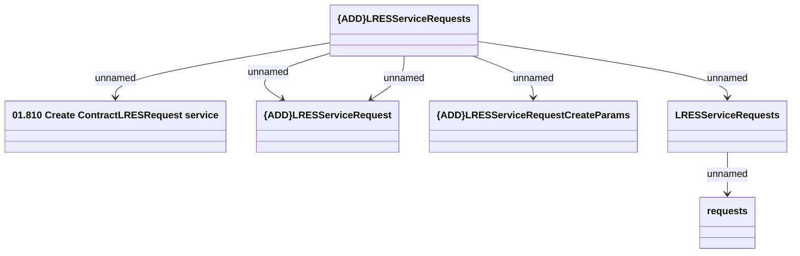

# Contract LRES Service Requests - create request

```mermaid
classDiagram
    class n_01_810_Create_ContractLRESRequest_service["01.810 Create ContractLRESRequest service"]
    class ADD_LRESServiceRequest["{ADD}LRESServiceRequest"]
    class ADD_LRESServiceRequestCreateParams["{ADD}LRESServiceRequestCreateParams"]
    class ADD_LRESServiceRequests["{ADD}LRESServiceRequests"]
    class LRESServiceRequests["LRESServiceRequests"]
    class requests["requests"]
    LRESServiceRequests --> requests : unnamed
    ADD_LRESServiceRequests --> LRESServiceRequests : unnamed
    ADD_LRESServiceRequests --> ADD_LRESServiceRequestCreateParams : unnamed
    ADD_LRESServiceRequests --> ADD_LRESServiceRequest : unnamed
    ADD_LRESServiceRequests --> ADD_LRESServiceRequest : unnamed
    ADD_LRESServiceRequests --> n_01_810_Create_ContractLRESRequest_service : unnamed
```
