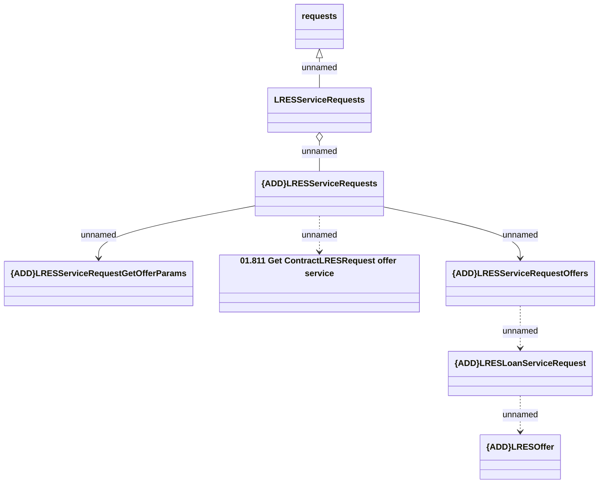

# Contract LRES Service Requests - get offer

- **Diagram Type**: Logical
- **Package**: HomerSelect/BSL/Analysis Model/Contract Management/Customer Self-Care API/Application Interface Model/CSI OpenAPI/Contract Service Requests/Contract LRES Service Requests
- **Diagram ID**: 131791
- **Elements**: 8
- **Connectors**: 7

