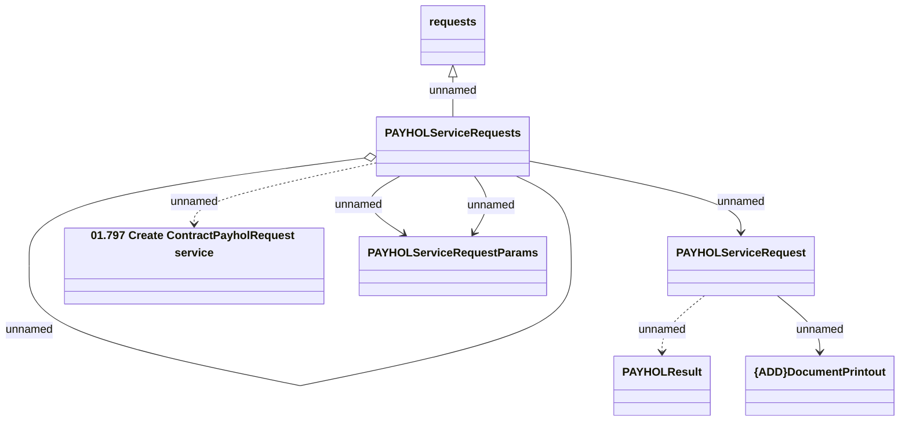

# Contract PAYHOL Service Requests - create request

- **Diagram Type**: Logical
- **Package**: HomerSelect/BSL/Analysis Model/Contract Management/Customer Self-Care API/Application Interface Model/CSI OpenAPI/Contract Service Requests/Contract PAYHOL Service Requests
- **Diagram ID**: 136510
- **Elements**: 8
- **Connectors**: 8

