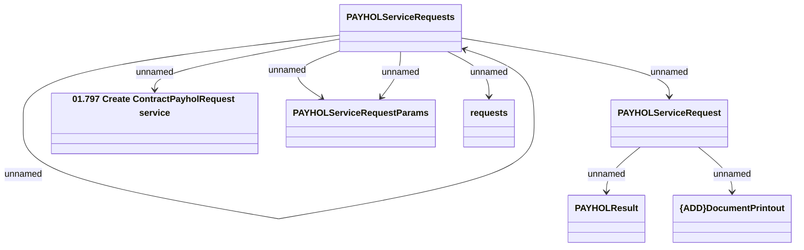

# Contract PAYHOL Service Requests - create request

```mermaid
classDiagram
    class ADD_DocumentPrintout["{ADD}DocumentPrintout"]
    class PAYHOLServiceRequest["PAYHOLServiceRequest"]
    class n_01_797_Create_ContractPayholRequest_service["01.797 Create ContractPayholRequest service"]
    class PAYHOLResult["PAYHOLResult"]
    class PAYHOLServiceRequestParams["PAYHOLServiceRequestParams"]
    class PAYHOLServiceRequests["PAYHOLServiceRequests"]
    class PAYHOLServiceRequests["PAYHOLServiceRequests"]
    class requests["requests"]
    PAYHOLServiceRequests --> requests : unnamed
    PAYHOLServiceRequests --> PAYHOLServiceRequests : unnamed
    PAYHOLServiceRequests --> PAYHOLServiceRequestParams : unnamed
    PAYHOLServiceRequests --> PAYHOLServiceRequestParams : unnamed
    PAYHOLServiceRequest --> PAYHOLResult : unnamed
    PAYHOLServiceRequests --> n_01_797_Create_ContractPayholRequest_service : unnamed
    PAYHOLServiceRequests --> PAYHOLServiceRequest : unnamed
    PAYHOLServiceRequest --> ADD_DocumentPrintout : unnamed
```
