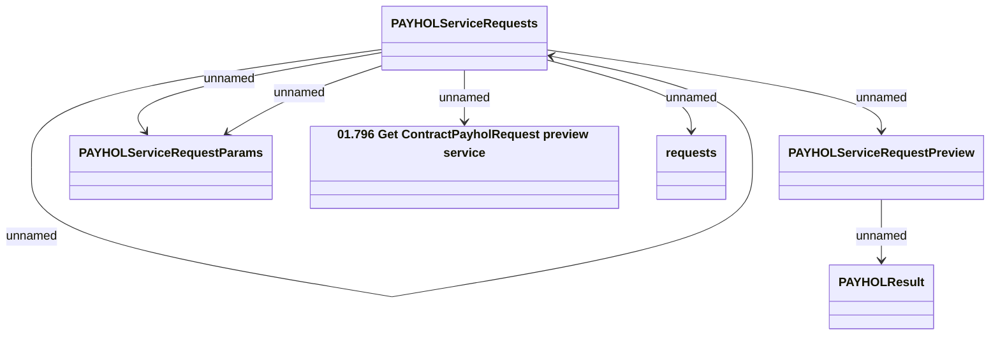

# Contract PAYHOL Service Requests - get preview

```mermaid
classDiagram
    class PAYHOLResult["PAYHOLResult"]
    class PAYHOLServiceRequestPreview["PAYHOLServiceRequestPreview"]
    class PAYHOLServiceRequestParams["PAYHOLServiceRequestParams"]
    class n_01_796_Get_ContractPayholRequest_preview_service["01.796 Get ContractPayholRequest preview service"]
    class PAYHOLServiceRequests["PAYHOLServiceRequests"]
    class PAYHOLServiceRequests["PAYHOLServiceRequests"]
    class requests["requests"]
    PAYHOLServiceRequests --> requests : unnamed
    PAYHOLServiceRequests --> PAYHOLServiceRequests : unnamed
    PAYHOLServiceRequests --> n_01_796_Get_ContractPayholRequest_preview_service : unnamed
    PAYHOLServiceRequests --> PAYHOLServiceRequestParams : unnamed
    PAYHOLServiceRequests --> PAYHOLServiceRequestParams : unnamed
    PAYHOLServiceRequests --> PAYHOLServiceRequestPreview : unnamed
    PAYHOLServiceRequestPreview --> PAYHOLResult : unnamed
```
