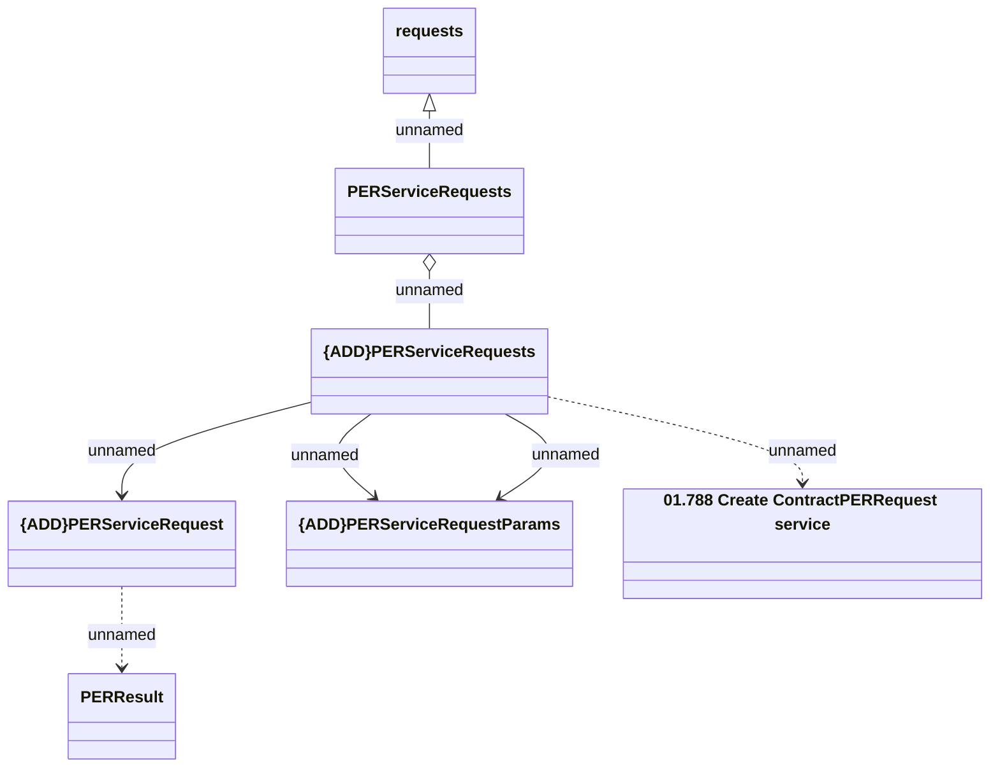

# Contract PER Service Requests - create request

- **Diagram Type**: Logical
- **Package**: HomerSelect/BSL/Analysis Model/Contract Management/Customer Self-Care API/Application Interface Model/CSI OpenAPI/Contract Service Requests/Contract PER Service Requests
- **Diagram ID**: 163958
- **Elements**: 7
- **Connectors**: 7

