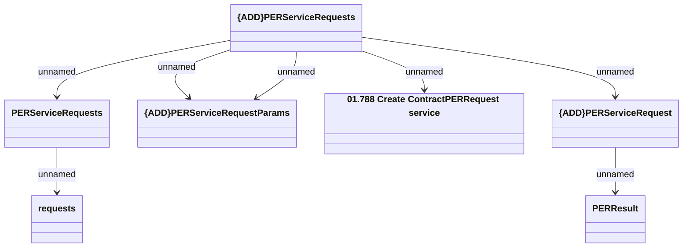

# Contract PER Service Requests - create request

```mermaid
classDiagram
    class ADD_PERServiceRequest["{ADD}PERServiceRequest"]
    class PERResult["PERResult"]
    class ADD_PERServiceRequestParams["{ADD}PERServiceRequestParams"]
    class n_01_788_Create_ContractPERRequest_service["01.788 Create ContractPERRequest service"]
    class requests["requests"]
    class PERServiceRequests["PERServiceRequests"]
    class ADD_PERServiceRequests["{ADD}PERServiceRequests"]
    ADD_PERServiceRequests --> PERServiceRequests : unnamed
    PERServiceRequests --> requests : unnamed
    ADD_PERServiceRequests --> n_01_788_Create_ContractPERRequest_service : unnamed
    ADD_PERServiceRequests --> ADD_PERServiceRequestParams : unnamed
    ADD_PERServiceRequests --> ADD_PERServiceRequestParams : unnamed
    ADD_PERServiceRequest --> PERResult : unnamed
    ADD_PERServiceRequests --> ADD_PERServiceRequest : unnamed
```
