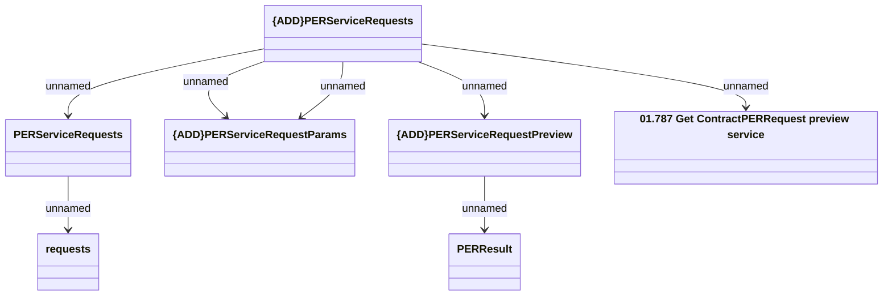

# Contract PER Service Requests - get preview

```mermaid
classDiagram
    class PERResult["PERResult"]
    class ADD_PERServiceRequestPreview["{ADD}PERServiceRequestPreview"]
    class ADD_PERServiceRequestParams["{ADD}PERServiceRequestParams"]
    class requests["requests"]
    class PERServiceRequests["PERServiceRequests"]
    class n_01_787_Get_ContractPERRequest_preview_service["01.787 Get ContractPERRequest preview service"]
    class ADD_PERServiceRequests["{ADD}PERServiceRequests"]
    ADD_PERServiceRequests --> n_01_787_Get_ContractPERRequest_preview_service : unnamed
    ADD_PERServiceRequests --> PERServiceRequests : unnamed
    PERServiceRequests --> requests : unnamed
    ADD_PERServiceRequests --> ADD_PERServiceRequestParams : unnamed
    ADD_PERServiceRequests --> ADD_PERServiceRequestParams : unnamed
    ADD_PERServiceRequests --> ADD_PERServiceRequestPreview : unnamed
    ADD_PERServiceRequestPreview --> PERResult : unnamed
```
