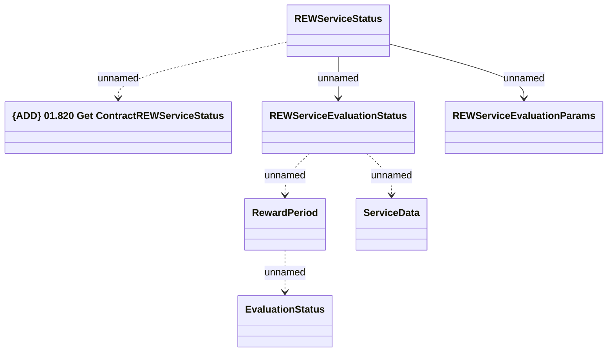

# Contract REW Service Status

- **Diagram Type**: Logical
- **Package**: HomerSelect/BSL/Analysis Model/Contract Management/Customer Self-Care API/Application Interface Model/CSI OpenAPI/Contract Service Requests/Contract REW Service Status
- **Diagram ID**: 162016
- **Elements**: 7
- **Connectors**: 6

