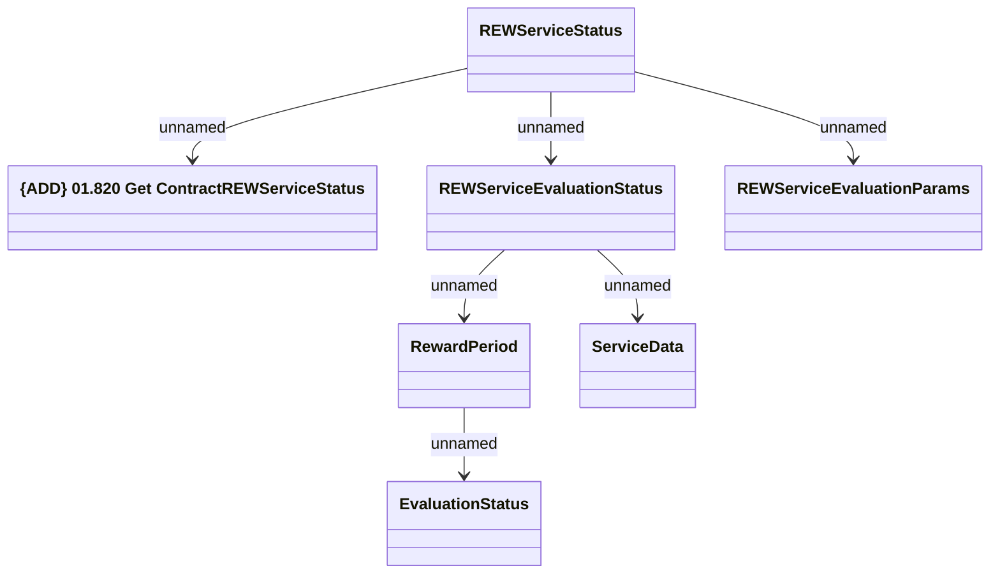

# Contract REW Service Status

```mermaid
classDiagram
    class ADD_01_820_Get_ContractREWServiceStatus["{ADD} 01.820 Get ContractREWServiceStatus"]
    class EvaluationStatus["EvaluationStatus"]
    class RewardPeriod["RewardPeriod"]
    class ServiceData["ServiceData"]
    class REWServiceEvaluationStatus["REWServiceEvaluationStatus"]
    class REWServiceEvaluationParams["REWServiceEvaluationParams"]
    class REWServiceStatus["REWServiceStatus"]
    REWServiceStatus --> REWServiceEvaluationParams : unnamed
    REWServiceStatus --> REWServiceEvaluationStatus : unnamed
    REWServiceEvaluationStatus --> ServiceData : unnamed
    REWServiceEvaluationStatus --> RewardPeriod : unnamed
    RewardPeriod --> EvaluationStatus : unnamed
    REWServiceStatus --> ADD_01_820_Get_ContractREWServiceStatus : unnamed
```
