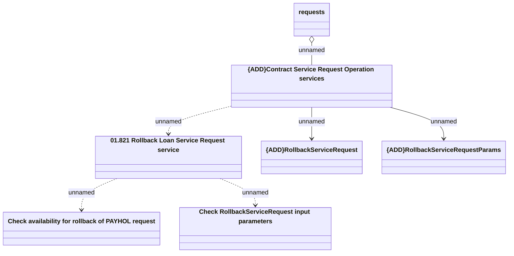

# Contract Service Request Operation

- **Diagram Type**: Logical
- **Package**: HomerSelect/BSL/Analysis Model/Contract Management/Customer Self-Care API/Application Interface Model/CSI OpenAPI/Contract Service Requests/Contract Service Request Operation
- **Diagram ID**: 132111
- **Elements**: 8
- **Connectors**: 6

