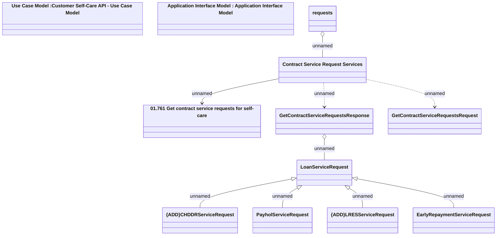

# Contract Service Requests

- **Diagram Type**: Logical
- **Package**: HomerSelect/BSL/Analysis Model/Contract Management/Customer Self-Care API/Application Interface Model/CSI OpenAPI/Contract Service Requests
- **Diagram ID**: 163321
- **Elements**: 12
- **Connectors**: 9

