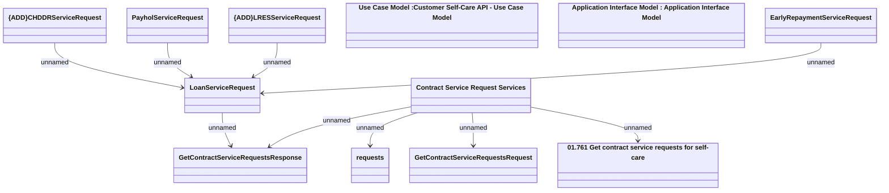

# Contract Service Requests

```mermaid
classDiagram
    class ADD_LRESServiceRequest["{ADD}LRESServiceRequest"]
    class ADD_CHDDRServiceRequest["{ADD}CHDDRServiceRequest"]
    class PayholServiceRequest["PayholServiceRequest"]
    class Use_Case_Model_Customer_Self_Care_API_Use_Case_Model["Use Case Model :Customer Self-Care API - Use Case Model"]
    class Application_Interface_Model_Application_Interface_Model["Application Interface Model : Application Interface Model"]
    class n_01_761_Get_contract_service_requests_for_self_care["01.761 Get contract service requests for self-care"]
    class Contract_Service_Request_Services["Contract Service Request Services"]
    class EarlyRepaymentServiceRequest["EarlyRepaymentServiceRequest"]
    class LoanServiceRequest["LoanServiceRequest"]
    class GetContractServiceRequestsResponse["GetContractServiceRequestsResponse"]
    class GetContractServiceRequestsRequest["GetContractServiceRequestsRequest"]
    class requests["requests"]
    Contract_Service_Request_Services --> requests : unnamed
    Contract_Service_Request_Services --> GetContractServiceRequestsRequest : unnamed
    LoanServiceRequest --> GetContractServiceRequestsResponse : unnamed
    Contract_Service_Request_Services --> GetContractServiceRequestsResponse : unnamed
    ADD_CHDDRServiceRequest --> LoanServiceRequest : unnamed
    PayholServiceRequest --> LoanServiceRequest : unnamed
    ADD_LRESServiceRequest --> LoanServiceRequest : unnamed
    EarlyRepaymentServiceRequest --> LoanServiceRequest : unnamed
    Contract_Service_Request_Services --> n_01_761_Get_contract_service_requests_for_self_care : unnamed
```
