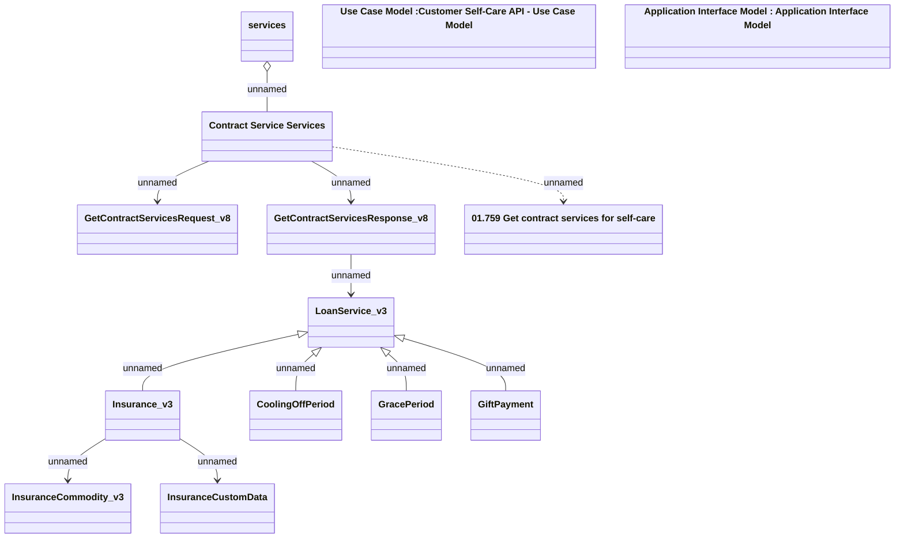

# Contract Services - GET contract services v8

- **Diagram Type**: Logical
- **Package**: HomerSelect/BSL/Analysis Model/Contract Management/Customer Self-Care API/Application Interface Model/CSI OpenAPI/Contract Services/v8
- **Diagram ID**: 148004
- **Elements**: 14
- **Connectors**: 11

