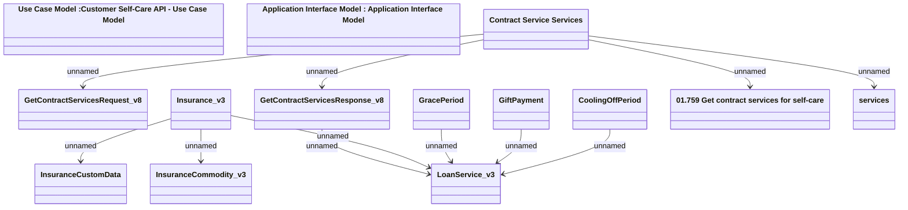

# Contract Services - GET contract services v8

```mermaid
classDiagram
    class InsuranceCustomData["InsuranceCustomData"]
    class GetContractServicesRequest_v8["GetContractServicesRequest_v8"]
    class GetContractServicesResponse_v8["GetContractServicesResponse_v8"]
    class Insurance_v3["Insurance_v3"]
    class InsuranceCommodity_v3["InsuranceCommodity_v3"]
    class LoanService_v3["LoanService_v3"]
    class CoolingOffPeriod["CoolingOffPeriod"]
    class GracePeriod["GracePeriod"]
    class GiftPayment["GiftPayment"]
    class Use_Case_Model_Customer_Self_Care_API_Use_Case_Model["Use Case Model :Customer Self-Care API - Use Case Model"]
    class Application_Interface_Model_Application_Interface_Model["Application Interface Model : Application Interface Model"]
    class Contract_Service_Services["Contract Service Services"]
    class n_01_759_Get_contract_services_for_self_care["01.759 Get contract services for self-care"]
    class services["services"]
    GetContractServicesResponse_v8 --> LoanService_v3 : unnamed
    Insurance_v3 --> InsuranceCommodity_v3 : unnamed
    Insurance_v3 --> InsuranceCustomData : unnamed
    Insurance_v3 --> LoanService_v3 : unnamed
    GracePeriod --> LoanService_v3 : unnamed
    GiftPayment --> LoanService_v3 : unnamed
    CoolingOffPeriod --> LoanService_v3 : unnamed
    Contract_Service_Services --> GetContractServicesRequest_v8 : unnamed
    Contract_Service_Services --> GetContractServicesResponse_v8 : unnamed
    Contract_Service_Services --> n_01_759_Get_contract_services_for_self_care : unnamed
    Contract_Service_Services --> services : unnamed
```
