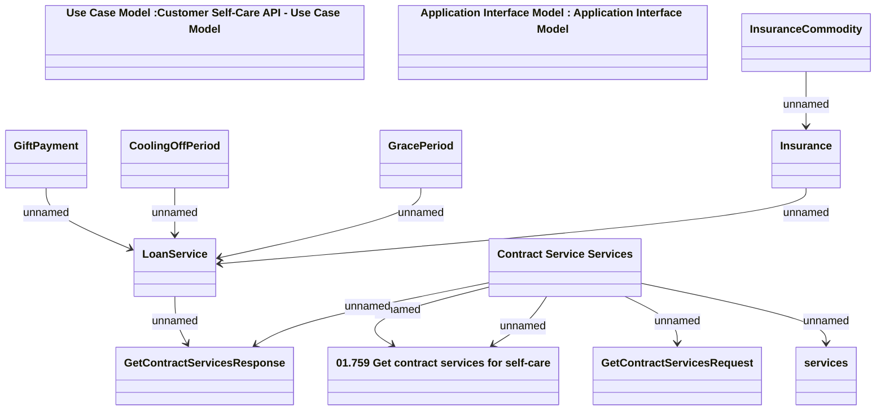

# Contract Services - GET contract services

```mermaid
classDiagram
    class CoolingOffPeriod["CoolingOffPeriod"]
    class GracePeriod["GracePeriod"]
    class GiftPayment["GiftPayment"]
    class Use_Case_Model_Customer_Self_Care_API_Use_Case_Model["Use Case Model :Customer Self-Care API - Use Case Model"]
    class Application_Interface_Model_Application_Interface_Model["Application Interface Model : Application Interface Model"]
    class Contract_Service_Services["Contract Service Services"]
    class InsuranceCommodity["InsuranceCommodity"]
    class Insurance["Insurance"]
    class LoanService["LoanService"]
    class GetContractServicesResponse["GetContractServicesResponse"]
    class GetContractServicesRequest["GetContractServicesRequest"]
    class services["services"]
    class n_01_759_Get_contract_services_for_self_care["01.759 Get contract services for self-care"]
    Contract_Service_Services --> n_01_759_Get_contract_services_for_self_care : unnamed
    Contract_Service_Services --> n_01_759_Get_contract_services_for_self_care : unnamed
    Contract_Service_Services --> GetContractServicesRequest : unnamed
    LoanService --> GetContractServicesResponse : unnamed
    Contract_Service_Services --> GetContractServicesResponse : unnamed
    GiftPayment --> LoanService : unnamed
    CoolingOffPeriod --> LoanService : unnamed
    GracePeriod --> LoanService : unnamed
    InsuranceCommodity --> Insurance : unnamed
    Insurance --> LoanService : unnamed
    Contract_Service_Services --> services : unnamed
```
