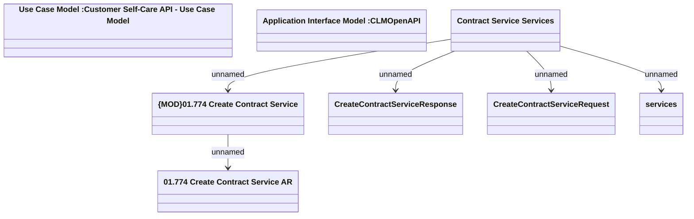

# Contract Services - POST create contract service

```mermaid
classDiagram
    class n_01_774_Create_Contract_Service_AR["01.774 Create Contract Service AR"]
    class MOD_01_774_Create_Contract_Service["{MOD}01.774 Create Contract Service"]
    class CreateContractServiceResponse["CreateContractServiceResponse"]
    class CreateContractServiceRequest["CreateContractServiceRequest"]
    class Use_Case_Model_Customer_Self_Care_API_Use_Case_Model["Use Case Model :Customer Self-Care API - Use Case Model"]
    class Application_Interface_Model_CLMOpenAPI["Application Interface Model :CLMOpenAPI"]
    class Contract_Service_Services["Contract Service Services"]
    class services["services"]
    Contract_Service_Services --> CreateContractServiceRequest : unnamed
    Contract_Service_Services --> CreateContractServiceResponse : unnamed
    Contract_Service_Services --> MOD_01_774_Create_Contract_Service : unnamed
    Contract_Service_Services --> services : unnamed
    MOD_01_774_Create_Contract_Service --> n_01_774_Create_Contract_Service_AR : unnamed
```
