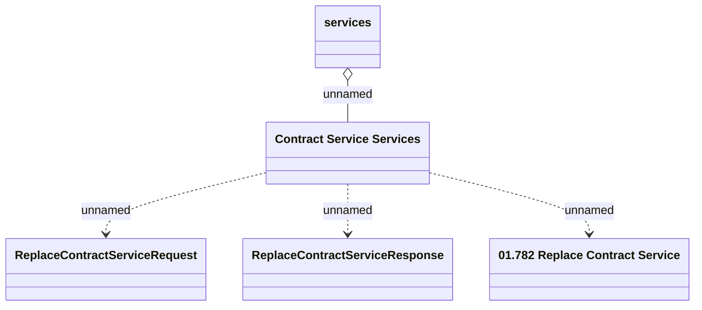

# Contract Services - POST replace contract service

- **Diagram Type**: Logical
- **Package**: HomerSelect/BSL/Analysis Model/Contract Management/Customer Self-Care API/Application Interface Model/CSI OpenAPI/Contract Services
- **Diagram ID**: 153263
- **Elements**: 5
- **Connectors**: 4

