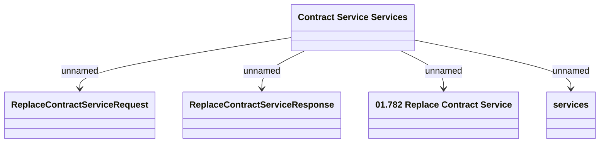

# Contract Services - POST replace contract service

```mermaid
classDiagram
    class n_01_782_Replace_Contract_Service["01.782 Replace Contract Service"]
    class ReplaceContractServiceResponse["ReplaceContractServiceResponse"]
    class ReplaceContractServiceRequest["ReplaceContractServiceRequest"]
    class Contract_Service_Services["Contract Service Services"]
    class services["services"]
    Contract_Service_Services --> ReplaceContractServiceRequest : unnamed
    Contract_Service_Services --> ReplaceContractServiceResponse : unnamed
    Contract_Service_Services --> n_01_782_Replace_Contract_Service : unnamed
    Contract_Service_Services --> services : unnamed
```
