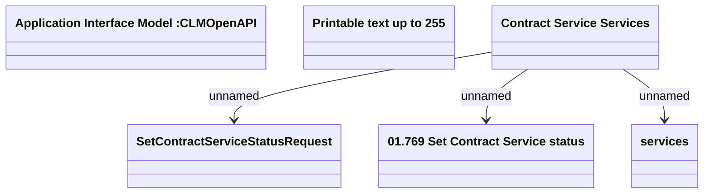

# Contract Services - PUT set contract service status

```mermaid
classDiagram
    class Application_Interface_Model_CLMOpenAPI["Application Interface Model :CLMOpenAPI"]
    class Printable_text_up_to_255["Printable text  up to 255"]
    class n_01_769_Set_Contract_Service_status["01.769 Set Contract Service status"]
    class Contract_Service_Services["Contract Service Services"]
    class services["services"]
    class SetContractServiceStatusRequest["SetContractServiceStatusRequest"]
    Contract_Service_Services --> SetContractServiceStatusRequest : unnamed
    Contract_Service_Services --> n_01_769_Set_Contract_Service_status : unnamed
    Contract_Service_Services --> services : unnamed
```
