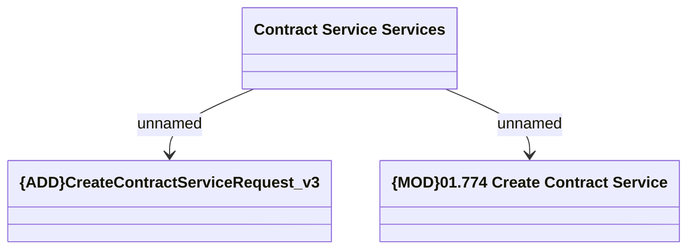

# ContractService - Create Contract Service method

```mermaid
classDiagram
    class ADD_CreateContractServiceRequest_v3["{ADD}CreateContractServiceRequest_v3"]
    class Contract_Service_Services["Contract Service Services"]
    class MOD_01_774_Create_Contract_Service["{MOD}01.774 Create Contract Service"]
    Contract_Service_Services --> ADD_CreateContractServiceRequest_v3 : unnamed
    Contract_Service_Services --> MOD_01_774_Create_Contract_Service : unnamed
```
