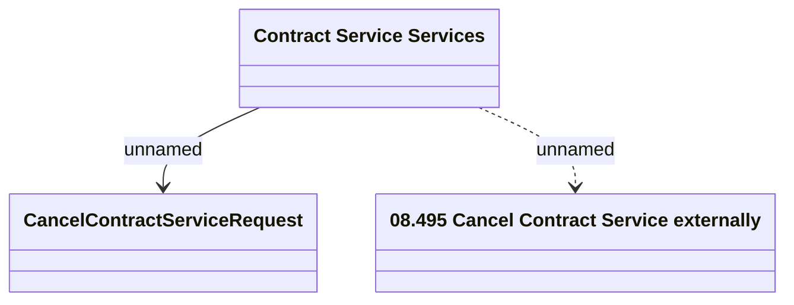

# ContractServices - Cancel ContractService

- **Diagram Type**: Logical
- **Package**: HomerSelect/BSL/Analysis Model/Contract Management/Customer Self-Care API/Application Interface Model/CSI OpenAPI/Contract Services/v3
- **Diagram ID**: 153260
- **Elements**: 3
- **Connectors**: 2

