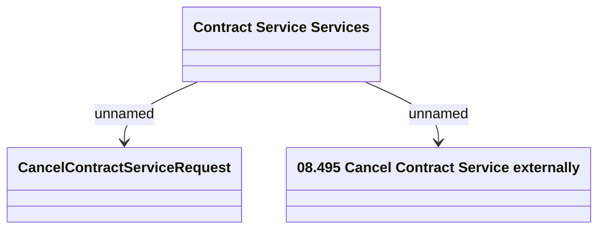

# ContractServices - Cancel ContractService

```mermaid
classDiagram
    class CancelContractServiceRequest["CancelContractServiceRequest"]
    class Contract_Service_Services["Contract Service Services"]
    class n_08_495_Cancel_Contract_Service_externally["08.495 Cancel Contract Service externally"]
    Contract_Service_Services --> CancelContractServiceRequest : unnamed
    Contract_Service_Services --> n_08_495_Cancel_Contract_Service_externally : unnamed
```
