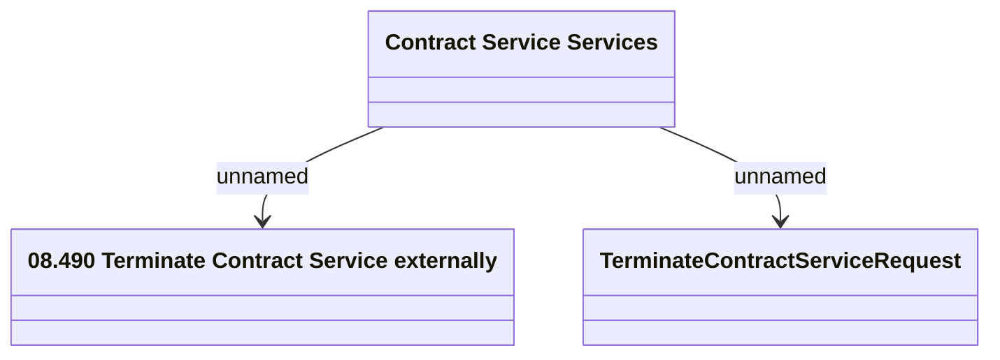

# ContractServices - Terminate ContractService

```mermaid
classDiagram
    class TerminateContractServiceRequest["TerminateContractServiceRequest"]
    class Contract_Service_Services["Contract Service Services"]
    class n_08_490_Terminate_Contract_Service_externally["08.490 Terminate Contract Service externally"]
    Contract_Service_Services --> n_08_490_Terminate_Contract_Service_externally : unnamed
    Contract_Service_Services --> TerminateContractServiceRequest : unnamed
```
