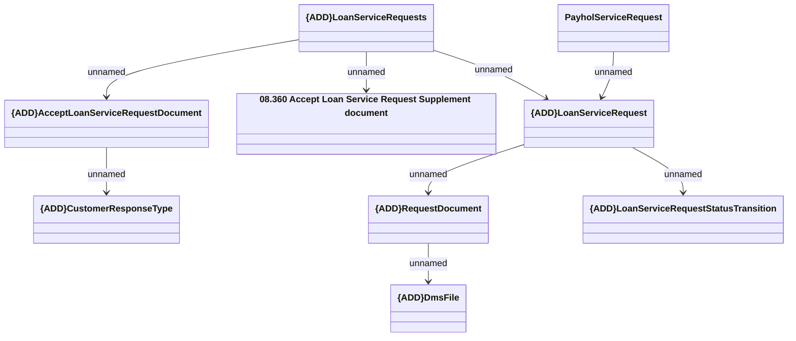

# Loan Service Requests - Document acceptation

```mermaid
classDiagram
    class ADD_CustomerResponseType["{ADD}CustomerResponseType"]
    class ADD_LoanServiceRequestStatusTransition["{ADD}LoanServiceRequestStatusTransition"]
    class PayholServiceRequest["PayholServiceRequest"]
    class ADD_LoanServiceRequest["{ADD}LoanServiceRequest"]
    class n_08_360_Accept_Loan_Service_Request_Supplement_document["08.360 Accept Loan Service Request Supplement document"]
    class ADD_DmsFile["{ADD}DmsFile"]
    class ADD_RequestDocument["{ADD}RequestDocument"]
    class ADD_AcceptLoanServiceRequestDocument["{ADD}AcceptLoanServiceRequestDocument"]
    class ADD_LoanServiceRequests["{ADD}LoanServiceRequests"]
    ADD_LoanServiceRequests --> ADD_AcceptLoanServiceRequestDocument : unnamed
    ADD_LoanServiceRequest --> ADD_RequestDocument : unnamed
    ADD_RequestDocument --> ADD_DmsFile : unnamed
    ADD_LoanServiceRequests --> n_08_360_Accept_Loan_Service_Request_Supplement_document : unnamed
    PayholServiceRequest --> ADD_LoanServiceRequest : unnamed
    ADD_LoanServiceRequests --> ADD_LoanServiceRequest : unnamed
    ADD_LoanServiceRequest --> ADD_LoanServiceRequestStatusTransition : unnamed
    ADD_AcceptLoanServiceRequestDocument --> ADD_CustomerResponseType : unnamed
```
