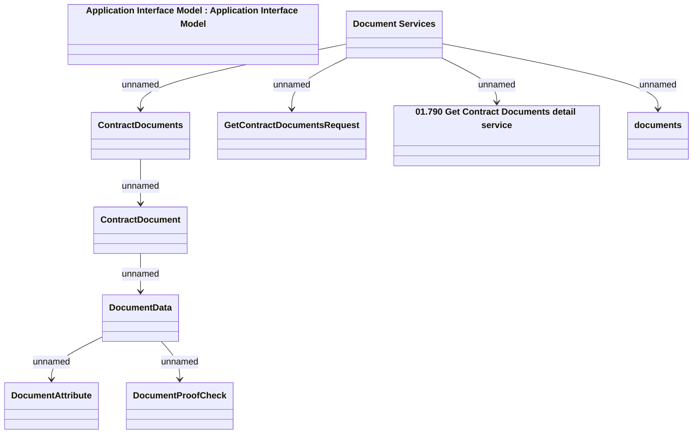

# Get Contract Documents detail v2

```mermaid
classDiagram
    class DocumentData["DocumentData"]
    class DocumentProofCheck["DocumentProofCheck"]
    class ContractDocument["ContractDocument"]
    class DocumentAttribute["DocumentAttribute"]
    class ContractDocuments["ContractDocuments"]
    class GetContractDocumentsRequest["GetContractDocumentsRequest"]
    class n_01_790_Get_Contract_Documents_detail_service["01.790 Get Contract Documents detail service"]
    class Application_Interface_Model_Application_Interface_Model["Application Interface Model : Application Interface Model"]
    class Document_Services["Document Services"]
    class documents["documents"]
    ContractDocument --> DocumentData : unnamed
    DocumentData --> DocumentAttribute : unnamed
    ContractDocuments --> ContractDocument : unnamed
    DocumentData --> DocumentProofCheck : unnamed
    Document_Services --> GetContractDocumentsRequest : unnamed
    Document_Services --> n_01_790_Get_Contract_Documents_detail_service : unnamed
    Document_Services --> ContractDocuments : unnamed
    Document_Services --> documents : unnamed
```
