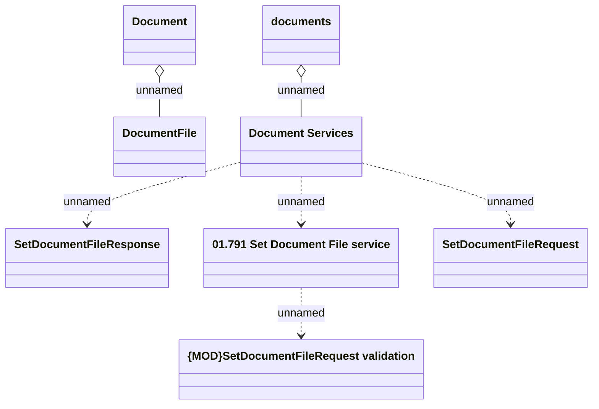

# Set Document File v2

- **Diagram Type**: Logical
- **Package**: HomerSelect/BSL/Analysis Model/Contract Management/Customer Self-Care API/Application Interface Model/CSI OpenAPI/Documents/SetDocumentFile_v2
- **Diagram ID**: 131740
- **Elements**: 8
- **Connectors**: 6

