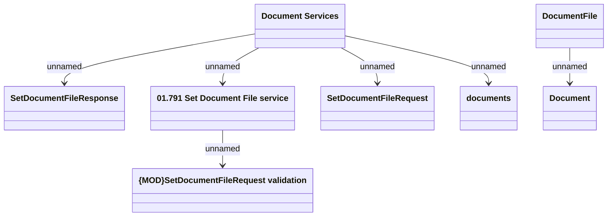

# Set Document File v2

```mermaid
classDiagram
    class SetDocumentFileResponse["SetDocumentFileResponse"]
    class MOD_SetDocumentFileRequest_validation["{MOD}SetDocumentFileRequest validation"]
    class n_01_791_Set_Document_File_service["01.791 Set Document File service"]
    class SetDocumentFileRequest["SetDocumentFileRequest"]
    class documents["documents"]
    class Document_Services["Document Services"]
    class Document["Document"]
    class DocumentFile["DocumentFile"]
    n_01_791_Set_Document_File_service --> MOD_SetDocumentFileRequest_validation : unnamed
    Document_Services --> SetDocumentFileResponse : unnamed
    Document_Services --> n_01_791_Set_Document_File_service : unnamed
    Document_Services --> documents : unnamed
    Document_Services --> SetDocumentFileRequest : unnamed
    DocumentFile --> Document : unnamed
```
