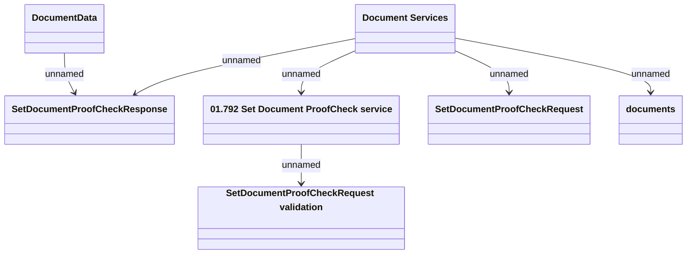

# SettingDocumentProofCheck_v1

```mermaid
classDiagram
    class DocumentData["DocumentData"]
    class SetDocumentProofCheckResponse["SetDocumentProofCheckResponse"]
    class SetDocumentProofCheckRequest_validation["SetDocumentProofCheckRequest validation"]
    class n_01_792_Set_Document_ProofCheck_service["01.792 Set Document ProofCheck service"]
    class SetDocumentProofCheckRequest["SetDocumentProofCheckRequest"]
    class Document_Services["Document Services"]
    class documents["documents"]
    DocumentData --> SetDocumentProofCheckResponse : unnamed
    n_01_792_Set_Document_ProofCheck_service --> SetDocumentProofCheckRequest_validation : unnamed
    Document_Services --> n_01_792_Set_Document_ProofCheck_service : unnamed
    Document_Services --> SetDocumentProofCheckRequest : unnamed
    Document_Services --> SetDocumentProofCheckResponse : unnamed
    Document_Services --> documents : unnamed
```
