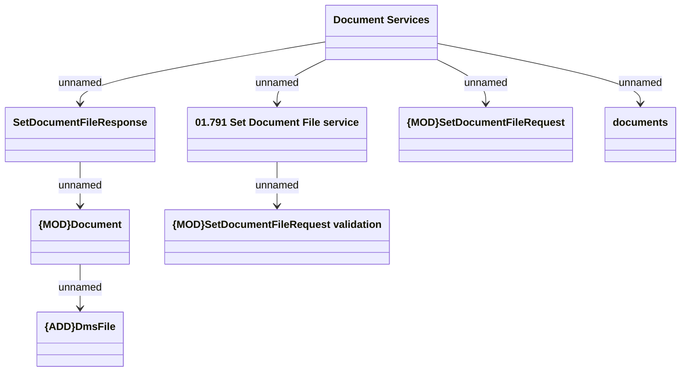

# {ADD}Set Document File v3

```mermaid
classDiagram
    class MOD_Document["{MOD}Document"]
    class ADD_DmsFile["{ADD}DmsFile"]
    class SetDocumentFileResponse["SetDocumentFileResponse"]
    class MOD_SetDocumentFileRequest_validation["{MOD}SetDocumentFileRequest validation"]
    class n_01_791_Set_Document_File_service["01.791 Set Document File service"]
    class MOD_SetDocumentFileRequest["{MOD}SetDocumentFileRequest"]
    class documents["documents"]
    class Document_Services["Document Services"]
    MOD_Document --> ADD_DmsFile : unnamed
    SetDocumentFileResponse --> MOD_Document : unnamed
    n_01_791_Set_Document_File_service --> MOD_SetDocumentFileRequest_validation : unnamed
    Document_Services --> n_01_791_Set_Document_File_service : unnamed
    Document_Services --> MOD_SetDocumentFileRequest : unnamed
    Document_Services --> SetDocumentFileResponse : unnamed
    Document_Services --> documents : unnamed
```
