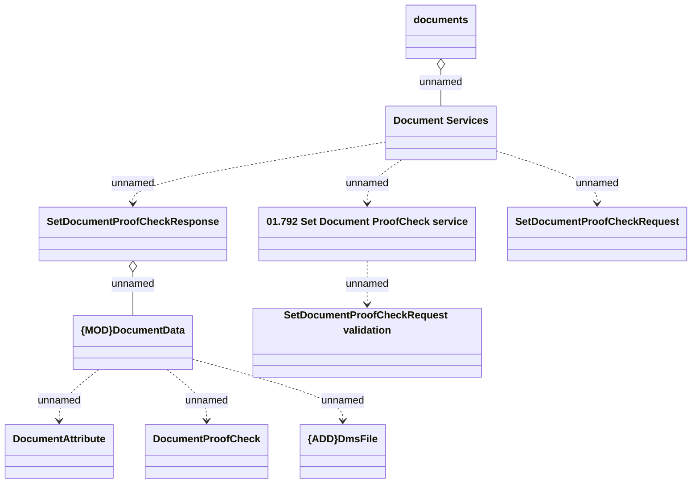

# {ADD}SettingDocumentProofCheck_v3

- **Diagram Type**: Logical
- **Package**: HomerSelect/BSL/Analysis Model/Contract Management/Customer Self-Care API/Application Interface Model/CSI OpenAPI/Documents/SettingDocumentProofCheck_v3
- **Diagram ID**: 131744
- **Elements**: 10
- **Connectors**: 9

