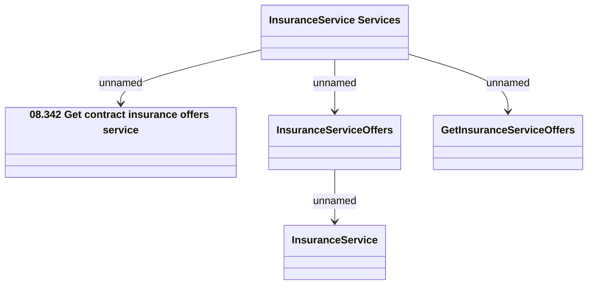

# Insurance Services - GET: Insurance Service Offer

```mermaid
classDiagram
    class n_08_342_Get_contract_insurance_offers_service["08.342 Get contract insurance offers service"]
    class InsuranceService["InsuranceService"]
    class InsuranceServiceOffers["InsuranceServiceOffers"]
    class GetInsuranceServiceOffers["GetInsuranceServiceOffers"]
    class InsuranceService_Services["InsuranceService Services"]
    InsuranceService_Services --> GetInsuranceServiceOffers : unnamed
    InsuranceService_Services --> InsuranceServiceOffers : unnamed
    InsuranceServiceOffers --> InsuranceService : unnamed
    InsuranceService_Services --> n_08_342_Get_contract_insurance_offers_service : unnamed
```
