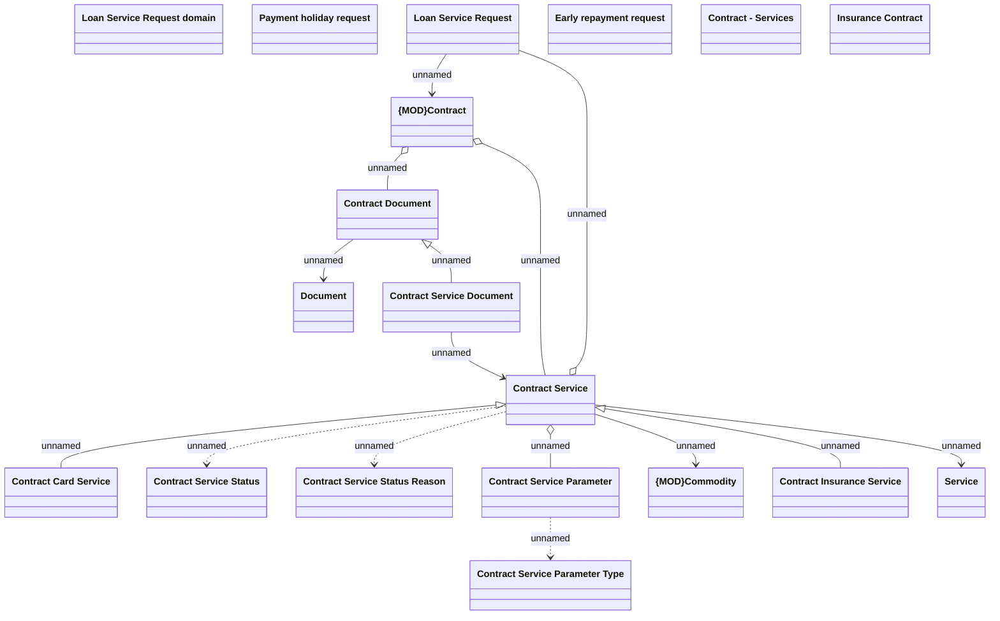

# Contract Service

- **Diagram Type**: Logical
- **Package**: HomerSelect/BSL/Analysis Model/Contract Management/Loan Service Processing/COMMON for Loan Services/Logical Data Model
- **Diagram ID**: 163280
- **Elements**: 19
- **Connectors**: 15

