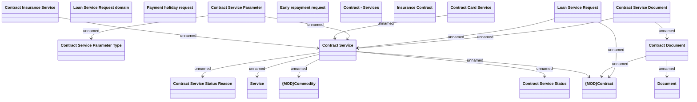

# Contract Service

```mermaid
classDiagram
    class Contract_Card_Service["Contract Card Service"]
    class Loan_Service_Request_domain["Loan Service Request domain"]
    class Payment_holiday_request["Payment holiday request"]
    class Loan_Service_Request["Loan Service Request"]
    class Early_repayment_request["Early repayment request"]
    class Contract_Services["Contract - Services"]
    class Insurance_Contract["Insurance Contract"]
    class Contract_Service_Status["Contract Service Status"]
    class Contract_Service_Status_Reason["Contract Service Status Reason"]
    class Contract_Service_Parameter_Type["Contract Service Parameter Type"]
    class Contract_Service_Parameter["Contract Service Parameter"]
    class Document["Document"]
    class Contract_Document["Contract Document"]
    class Contract_Service_Document["Contract Service Document"]
    class MOD_Commodity["{MOD}Commodity"]
    class Contract_Insurance_Service["Contract Insurance Service"]
    class Service["Service"]
    class Contract_Service["Contract Service"]
    class MOD_Contract["{MOD}Contract"]
    Contract_Service_Document --> Contract_Service : unnamed
    Loan_Service_Request --> Contract_Service : unnamed
    Loan_Service_Request --> MOD_Contract : unnamed
    Contract_Service_Parameter --> Contract_Service : unnamed
    Contract_Service_Parameter --> Contract_Service_Parameter_Type : unnamed
    Contract_Card_Service --> Contract_Service : unnamed
    Contract_Service_Document --> Contract_Document : unnamed
    Contract_Service --> Contract_Service_Status_Reason : unnamed
    Contract_Insurance_Service --> Contract_Service : unnamed
    Contract_Service --> Service : unnamed
    Contract_Service --> MOD_Commodity : unnamed
    Contract_Service --> Contract_Service_Status : unnamed
    Contract_Document --> Document : unnamed
    Contract_Document --> MOD_Contract : unnamed
    Contract_Service --> MOD_Contract : unnamed
```
