# Loan Service Request domain

- **Diagram Type**: Logical
- **Package**: HomerSelect/BSL/Analysis Model/Contract Management/Loan Service Processing/COMMON for Loan Services/Logical Data Model
- **Diagram ID**: 163279
- **Elements**: 33
- **Connectors**: 33

```mermaid
classDiagram
    class Interest_Back_Request["Interest Back Request"]
    class Logical_Data_Model_Interest_Back["Logical Data Model : Interest Back "]
    class Logical_Data_Model_Presented_interest_rate_Setting["Logical Data Model : Presented interest rate - Setting"]
    class MOD_Presented_IR_Setting["{MOD}Presented IR Setting"]
    class Logical_Data_Model_CEL_Rewards_request["Logical Data Model : CEL Rewards request"]
    class CEL_Reward_Request["CEL Reward Request"]
    class Service_Operation_Status_Type["Service Operation Status Type"]
    class diagram_3C962C90_F73F_4356_8BB4_758771D3FD88["$diagram://{3C962C90-F73F-4356-8BB4-758771D3FD88}"]
    class Logical_Data_Model_Loan_restructuring_request_domain["Logical Data Model : Loan restructuring request domain"]
    class Loan_Restructuring_Request["Loan Restructuring Request"]
    class Logical_Data_Model_Early_repayment_request["Logical Data Model : Early repayment request"]
    class Logical_Data_Model_Payment_holiday_request["Logical Data Model : Payment holiday request"]
    class Logical_Data_Model_Change_due_date_request["Logical Data Model : Change due date request"]
    class Change_Due_Date_Request["Change Due Date Request"]
    class Loan_Service_Request_Presented_Interest_Rate["Loan Service Request Presented Interest Rate"]
    class Recalculation_Reason["Recalculation Reason"]
    class Installment_Type["Installment Type"]
    class Service_Offer_Installment_Part["Service Offer Installment Part"]
    class Service_Offer_Installment["Service Offer Installment"]
    class MOD_Tariff_Item["{MOD}Tariff Item"]
    class Charged_Fee_To_Request["Charged Fee To Request"]
    class Document["Document"]
    class Document_Type["Document Type"]
    class Loan_Service_Request_Document["Loan Service Request Document"]
    class DMS_File["DMS File"]
    class Loan_Service_Request_Status_Transition["Loan Service Request Status Transition"]
    class Loan_Service_Request_Status_Type["Loan Service Request Status Type"]
    class Service["Service"]
    class Payment_Holiday_Request["Payment Holiday Request"]
    class Loan_Service_Request["Loan Service Request"]
    class Contract_Service["Contract Service"]
    class MOD_Contract["{MOD}Contract"]
    class Early_Repayment_Request["Early Repayment Request"]
    Logical_Data_Model_Payment_holiday_request --> Payment_Holiday_Request : unnamed
    Service_Offer_Installment --> Installment_Type : unnamed
    Service_Offer_Installment o-- Service_Offer_Installment_Part : unnamed
    Loan_Service_Request o-- Loan_Service_Request_Presented_Interest_Rate : unnamed
    Loan_Service_Request_Presented_Interest_Rate --> MOD_Presented_IR_Setting : unnamed
    Logical_Data_Model_Interest_Back --> Interest_Back_Request : unnamed
    Logical_Data_Model_Change_due_date_request --> Change_Due_Date_Request : unnamed
    Charged_Fee_To_Request --> MOD_Tariff_Item : unnamed
    Logical_Data_Model_Early_repayment_request --> Early_Repayment_Request : unnamed
    Loan_Service_Request <|-- Loan_Restructuring_Request : unnamed
    Logical_Data_Model_Loan_restructuring_request_domain --> Loan_Restructuring_Request : unnamed
    diagram_3C962C90_F73F_4356_8BB4_758771D3FD88 --> Loan_Service_Request : unnamed
    Loan_Service_Request <|-- CEL_Reward_Request : unnamed
    Logical_Data_Model_CEL_Rewards_request --> CEL_Reward_Request : unnamed
    Loan_Service_Request <|-- Change_Due_Date_Request : unnamed
    Loan_Service_Request o-- Loan_Service_Request_Status_Transition : unnamed
    Contract_Service --> Service : unnamed
    Loan_Service_Request ..> Loan_Service_Request_Status_Type : unnamed
    Loan_Service_Request --> MOD_Contract : unnamed
    Loan_Service_Request ..> Service_Operation_Status_Type : unnamed
    Contract_Service o-- Loan_Service_Request : unnamed
    Service_Offer_Installment --> Recalculation_Reason : unnamed
    Loan_Service_Request_Status_Transition ..> Loan_Service_Request_Status_Type : unnamed
    Loan_Service_Request o-- Service_Offer_Installment : unnamed
    DMS_File --> DMS_File : unnamed
    Loan_Service_Request o-- Loan_Service_Request_Document : unnamed
    Loan_Service_Request_Document --> Document : unnamed
    Loan_Service_Request o-- Charged_Fee_To_Request : unnamed
    Loan_Service_Request <|-- Payment_Holiday_Request : unnamed
    Loan_Service_Request <|-- Interest_Back_Request : unnamed
    Loan_Service_Request <|-- Early_Repayment_Request : unnamed
    Document --> Document_Type : unnamed
    MOD_Contract o-- Contract_Service : unnamed
```

