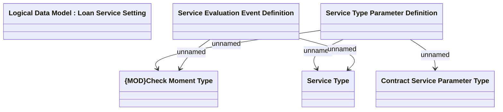

# Service Processing Setting

```mermaid
classDiagram
    class Logical_Data_Model_Loan_Service_Setting["Logical Data Model : Loan Service Setting"]
    class Service_Evaluation_Event_Definition["Service Evaluation Event Definition"]
    class Contract_Service_Parameter_Type["Contract Service Parameter Type"]
    class Service_Type_Parameter_Definition["Service Type Parameter Definition"]
    class MOD_Check_Moment_Type["{MOD}Check Moment Type"]
    class Service_Type["Service Type"]
    Service_Type_Parameter_Definition --> Contract_Service_Parameter_Type : unnamed
    Service_Type_Parameter_Definition --> Service_Type : unnamed
    Service_Type_Parameter_Definition --> MOD_Check_Moment_Type : unnamed
    Service_Evaluation_Event_Definition --> MOD_Check_Moment_Type : unnamed
    Service_Evaluation_Event_Definition --> Service_Type : unnamed
```
