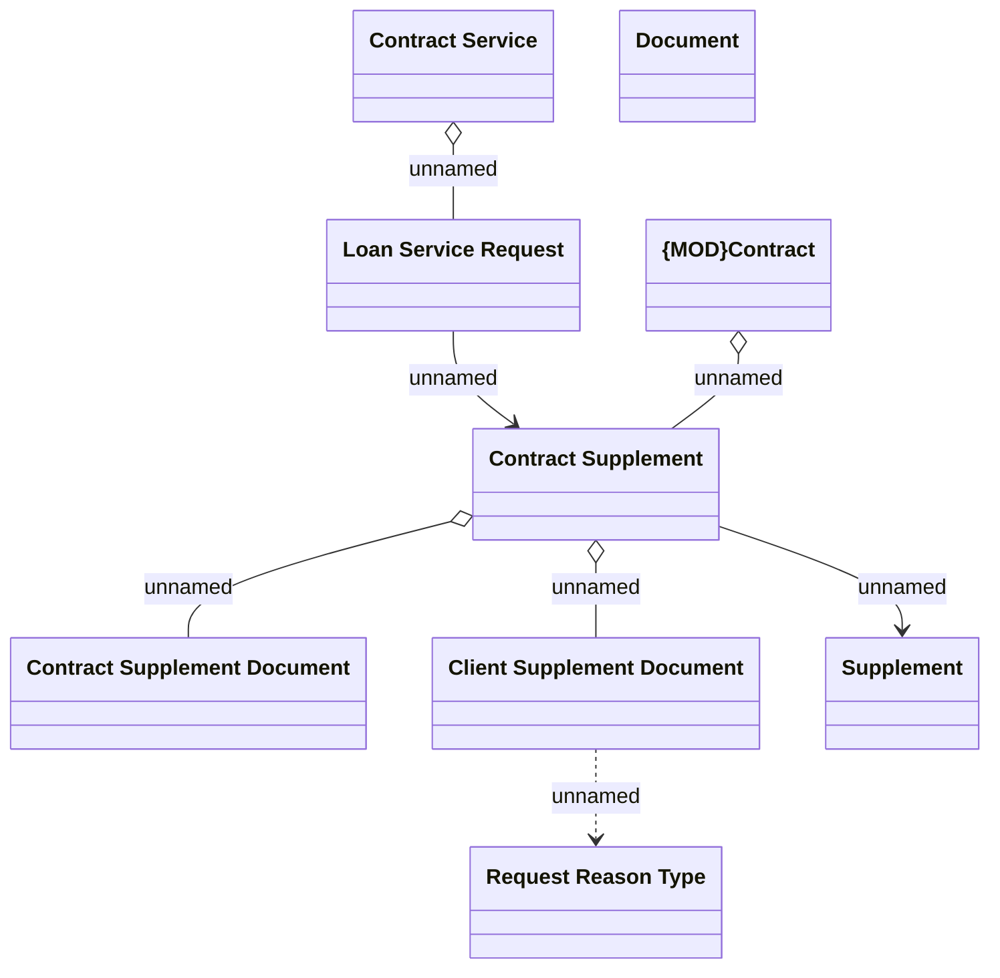

# Collection tool operation domains

- **Diagram Type**: Logical
- **Package**: HomerSelect/BSL/Analysis Model/Contract Management/Loan Service Processing/Collection tools support/Collection tools requests/Logical Data Model
- **Diagram ID**: 85504
- **Elements**: 9
- **Connectors**: 7

